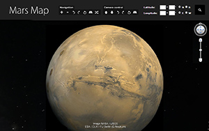

# huoxing.luhui.net

# 鲁虺火星地图 luhui Mars 3D Map
http://mars.luhui.net

申请谷歌api改网页第17行的域名所属api

修改buttons.js第11行

# Deploy status badge部署状态徽章

This image automatically updates to reflect the current state of your latest production deploy. You can use the markdown snippet below to add it to your project README.
 该映像会自动更新以反映最新生产部署的当前状态。您可以使用下面的markdown代码片段将其添加到您的项目README中。
 
 http://huoxing.netlify.app
 

# 鲁虺火星地图自定义域名演示

http://huoxing.luhui.net

# 鲁虺3D火星探索星图，使用谷歌地球插件.卫星图像从任务、 环形山和山。

鲁虺火星三维地图允许您查看火星景观以新的方式。
在这个项目中使用谷歌地球 API。谷歌地球插件允许您浏览和探索火星地理数据在使用 web 浏览器的 3D 球体上。轻松导航。使用新的导航面板可放大和缩小、 旋转左或向右，使 360 ° 旋转视图，倾斜地球的地图或只是按随机按钮以找到一个新的令人惊奇的地方。相机控制。你可以调整摄像机的位置，在高度、 旋转和倾斜。搜索。键入任意坐标-一个地方的经度和纬度。新的有趣的地方在地图上。下拉菜单中的有趣的地方列表将帮助您找到他们在哪里。抽象列表中显示非流行区域如沙漠 Riples、 秘密脸火山口中心、 黑色沙丘、 网络系统、 黑水河、 线条柔和、 黑洞和更多。仍然到来都是受欢迎的地方、 山脉、 着陆点的列表。如果该插件不正常工作与铬，请参阅铬帮助中心，了解如何更新到最新版本。地球插件要求： 微软视窗 (Windows XP、 Windows Vista 和 Windows 7) 或苹果 Mac OS X 10.6 或更高版本 （任何英特尔 Mac）。火星后水星是离太阳第四的行星和太阳系中第二小的行星。罗马战神的名字命名的它常常被称为"红色星球"因为普遍在其表面氧化铁给它会呈现出红色。火星是稀薄的大气层，与类地行星兼备的月亮和火山、 河谷、 沙漠和极地冰帽的地球撞击坑的表面特征想起。自转周期和季节周期的火星同样是类似于地球，正如生产四季的倾斜。火星是该网站的奥林匹斯山，第二个 （最高在一个星球上） 太阳系内的已知的最高峰，和水手，最大的峡谷之一。光滑的北极盆地在北半球覆盖 40%的地球，可能是一个巨大的冲击特征。火星是主机到七运作航天器： 五个在轨道上 — — 火星奥德赛号、 火星快车、 火星勘测轨道飞行器，MAVEN 和火星轨道飞行器任务 — — 和两个表面 — — 火星探测漫游者机遇和火星科学实验室的好奇心。航天器表面上的包括 MER-A 精神和几个其他惰性的登陆器和探测器等凤凰号着陆，在 2008 年完成其使命。由火星勘测轨道飞行器的观察显示可能流动的水在火星上最热的月份。火星可以很容易被视为从地球用肉眼，可以其红色的着色。其视星等达到 ?3.0，仅次于木星、 金星、 月球、 太阳光学地面天文望远镜，通常局限于跨解决约 300 公里 （186 英里） 的功能，当地球和火星是最接近的因为地球的大气层。

     
        Installed Plugin Version: Google Maps JavaScript API
          
      Mars 3D Map allows you to view Mars landscape in a new way. 
     
    Mars is the fourth planet from the Sun and the second smallest planet in the Solar System, after Mercury. Named after the Roman god of war, it is often described as the "Red Planet" because the iron oxide prevalent on its surface gives it a reddish appearance. Mars is a terrestrial planet with a thin atmosphere, having surface features reminiscent both of the impact craters of the Moon and the volcanoes, valleys, deserts, and polar ice caps of Earth. The rotational period and seasonal cycles of Mars are likewise similar to those of Earth, as is the tilt that produces the seasons. Mars is the site of Olympus Mons, the second highest known mountain within the Solar System (the tallest on a planet), and of Valles Marineris, one of the largest canyons. The smooth Borealis basin in the northern hemisphere covers 40% of the planet and may be a giant impact feature. 
     
Mars is host to seven functioning spacecraft: five in orbit – the Mars Odyssey, Mars Express, Mars Reconnaissance Orbiter, MAVEN and Mars Orbiter Mission – and two on the surface – Mars Exploration Rover Opportunity and the Mars Science Laboratory Curiosity. Defunct spacecraft on the surface include MER-A Spirit and several other inert landers and rovers such as the Phoenix lander, which completed its mission in 2008. Observations by the Mars Reconnaissance Orbiter have revealed possible flowing water during the warmest months on Mars.
     
Mars can easily be seen from Earth with the naked eye, as can its reddish coloring. Its apparent magnitude reaches −3.0, which is surpassed only by Jupiter, Venus, the Moon, and the Sun. Optical ground-based telescopes are typically limited to resolving features about 300 km (186 miles) across when Earth and Mars are closest because of Earth's atmosphere. (Source: <a href="http://en.wikipedia.org/wiki/Mars">Wikipedia</a>)
         
         
        

            
            Screenshot of Mars 3D Map's website
        

        

            
            Screenshot of Mars 3D Map's website
        

         
      Google Maps API is used in this project.     
         
    The Google Maps plug-in allows you to navigate and explore Mars geographic data using a web browser.
      
    Easy Navigation 
    Use the new navigation panel to zoom in and zoom out or just press the random button to find a new amazing place. 
      
    New interesting places on the map 
 A drop down menu with a list of interesting places will help you to find where they are. The abstract list shows non popular areas like Desert Riples, Secret face Crater's center, Black Dune, Network System, Black River, Soft Lines, Black Holes and more. 
Still to come are lists with popular places on Mars like mountains, landing places and more.  
      
    

     
     
    

        

            
     

        

  
  
  
  
